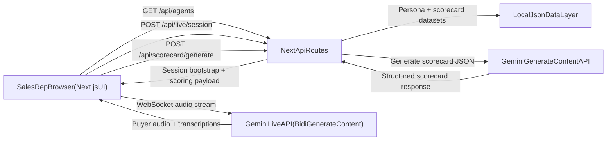

# PitchPerfect AI

PitchPerfect AI is a real-time voice sales roleplay platform built for rapid B2B call practice.
Reps choose a buyer persona, run a live AI call, and receive instant coaching feedback with transcript-backed scoring.

## Built With

- TypeScript
- Next.js (App Router) + React
- Tailwind CSS
- shadcn/ui
- Native WebSockets + Web Audio API + MediaRecorder API
- Google Gemini Live API (`gemini-2.0-flash-exp`) for real-time voice simulation
- Google Gemini API (`gemini-2.0-flash`) for post-call scorecard generation
- Google Cloud Platform (Cloud Run hosting)

## Repository Structure

This repository is monorepo-style at the root, with the app inside `web/`.

- `web/app/roleplay` - persona selection, live call room, results
- `web/app/api/live/session` - live session bootstrap endpoint
- `web/app/api/scorecard/generate` - post-call AI scorecard endpoint
- `web/components/live` - live call UI and streaming panel
- `web/components/results` - transcript, analytics, and scorecard UI
- `web/lib/data` - agent + attributes + scorecard dataset normalization
- `web/lib/prompts` - system instruction construction for persona roleplay

## Prerequisites

- Node.js 20+
- npm 10+
- Gemini API key (Google AI Studio / Google Cloud)

## Quick Start

1) Install dependencies:

```bash
cd web
npm install
```

2) Create `web/.env.local`:

```bash
GEMINI_API_KEY=your_api_key_here
```

3) Run the app:

```bash
npm run dev
```

4) Open [http://localhost:3000](http://localhost:3000)

## Reproducible Testing (Judge Guide)

Use this exact flow to validate functionality end-to-end.

### 1) Static checks

```bash
cd web
npm run lint
npm run build
```

Expected:
- Lint passes without blocking errors.
- Build completes successfully.

### 2) Run local server

```bash
npm run dev
```

Open:
- `http://localhost:3000/roleplay`

### 3) Functional roleplay test

1. Choose any buyer persona.
2. Select one or more objections (optional).
3. Click **Start Call**.
4. Allow microphone access.
5. Speak with the AI buyer for 30-60 seconds.
6. Click **End Call**.
7. Confirm results page shows:
   - full transcript
   - transcript analytics cards
   - generated scorecard sections (Opener, Discovery, Social Proof, Takeaway, Closing)

### 4) API sanity checks (optional)

You can test the app APIs directly:

- `GET /api/agents` -> returns persona list
- `POST /api/live/session` -> returns live bootstrap payload
- `POST /api/scorecard/generate` -> returns structured scorecard JSON

Example `scorecard` request:

```bash
curl -X POST http://localhost:3000/api/scorecard/generate \
  -H "Content-Type: application/json" \
  -d '{
    "agentId": 1,
    "callId": "local-test-call",
    "transcript": [
      { "speaker": "rep", "text": "Hi, this is Alex from PitchPerfect.", "timestamp": "2026-01-01T10:00:00.000Z" },
      { "speaker": "buyer", "text": "Can you make this quick?", "timestamp": "2026-01-01T10:00:04.000Z" }
    ]
  }'
```

## Environment Variables

Required:

- `GEMINI_API_KEY` - used by live session and scorecard generation APIs

Notes:
- Do not commit `.env.local`.
- In deployment, configure env vars on Cloud Run service settings.

## Architecture Diagram

Use this diagram for Devpost Image Gallery or File Upload.



### Data Flow Summary

- Browser calls Next.js APIs for session bootstrap and scorecard generation.
- Browser streams microphone audio directly to Gemini Live over WebSocket.
- Next.js scoring route sends transcript to Gemini text API and normalizes JSON output.
- Roleplay personas and rubric are loaded from local JSON datasets in the app.

## GCP Deployment (Cloud Run)

1. Install and authenticate Google Cloud CLI:
   - `gcloud auth login`
   - `gcloud config set project YOUR_PROJECT_ID`
2. Enable required services:
   - Cloud Run API
   - Cloud Build API
   - Artifact Registry API
3. Deploy from source (`web` directory):

```bash
gcloud run deploy pitchperfect-ai \
  --source ./web \
  --region us-central1 \
  --allow-unauthenticated \
  --set-env-vars GEMINI_API_KEY=your_api_key_here
```

4. Open the generated Cloud Run URL.

After deploy:
- open `/roleplay`
- run one live call
- verify transcript + analytics + scorecard on results page

## Known Limitations

- Live call quality and stability depend on browser permissions and microphone setup.
- Gemini quota or billing limits can block live and/or scorecard generation.
- If `GEMINI_API_KEY` is missing, scorecard generation returns explicit error states.

## Troubleshooting

- **Push rejected due to large files (`node_modules`, `.next`)**
  - Ensure these paths are in `.gitignore`
  - Remove tracked artifacts from git index and recommit
- **No transcript on results**
  - Confirm call ran long enough for multiple transcript turns
  - Verify browser storage is enabled (session storage)
- **Scorecard generation fails**
  - Verify `GEMINI_API_KEY` is set
  - Check Gemini quota/billing and retry

## Hackathon Note

PitchPerfect AI focuses on:
- real-time AI voice roleplay for sales reps
- dynamic objection handling through prompt injection
- strict, structured post-call scoring for actionable coaching
